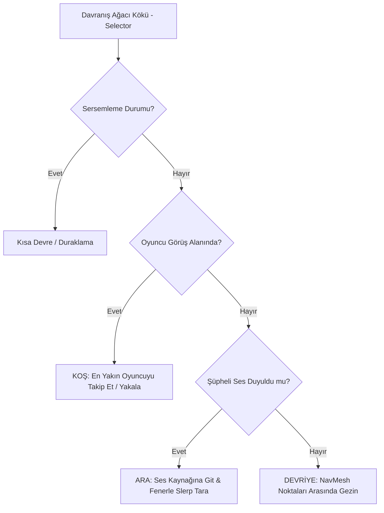

# Yapay Zeka ve NPC Ekosistemi Tasarım Belgesi (Ultimate NPCBehaviorSystem)

Bu belge; yapay zeka devriye noktası hesaplama ve fener/bakış yönü Slerp rotasyon interpolasyon pseudo-kodlarını ve NPC zorluk veri sınıflarını tanımlayan nihai teknik şartnameyi içerir.

---

## 1. Devriye ve Yumuşak Arama Açı İnterpolasyon Pseudo-Kodu (NavMesh & Steering)

Aşağıdaki pseudo-kod, `GuardRobotAI` bileşeninin devriye atarken rastgele NavMesh koordinatı seçmesini ve bir ses duyduğunda fenerini/bakış yönünü o yöne doğru nasıl yumuşakça döndürdüğünü gösterir:

```
FONKSİYON PatrolAndSearchUpdate(deltaTime)
    // 1. Devriye Noktası Seçim Algoritması (Patrol Waypoint Selection)
    EGER CurrentState == GuardState.Patrol VE (NavMeshAgent.RemainingDistance <= 0.5 VEYA NavMeshAgent.HasPath == YANLIS):
        // Belirli bir yarıçap içinde rastgele bir NavMesh noktası bul
        RastgeleAci = Rastgele.Range(0, 2 * PI)
        RastgeleMesafe = Rastgele.Range(MinPatrolRange, MaxPatrolRange)
        HedefOfset = Vector3(Cos(RastgeleAci) * RastgeleMesafe, 0, Sin(RastgeleAci) * RastgeleMesafe)
        PotansiyelHedef = GameObject.Position + HedefOfset

        ZeminNoktasi, DogrulananHedef = NavMesh.SamplePosition(PotansiyelHedef, MaxSearchRadius)
        EGER ZeminNoktasi == DOGRU:
            NavMeshAgent.SetDestination(DogrulananHedef)
        SONRA
    SONRA

    // 2. Şüpheli Sese Yumuşak Yönelme (Steering / Slerp Rotation)
    EGER CurrentState == GuardState.Search VE IsNoiseHeard == DOGRU:
        // Ses kaynağının yönünü hesapla (y ekseni sabitlenir)
        HedefYonVektoru = (NoiseOrigin.Position - GameObject.Position)
        HedefYonVektoru.Y = 0 // Yukarı/Aşağı bükülmeyi engelle
        HedefYonVektoru = HedefYonVektoru.Normal

        // Hedef rotasyonu (Quaternion) oluştur
        HedefRotasyonu = Quaternion.LookRotation(HedefYonVektoru)

        // Mevcut rotasyonu hedef rotasyona yumuşakça döndür (Slerp)
        MevcutRotasyon = GameObject.Rotation
        DonusHiziMultiplier = GuardRotationSpeed // Açısal hız katsayısı
        
        GameObject.Rotation = Quaternion.Slerp(
            MevcutRotasyon, 
            HedefRotasyonu, 
            deltaTime * DonusHiziMultiplier
        )

        // Fener ışığını doğrudan bakış yönüyle senkronize et
        FlashlightObject.Rotation = GameObject.Rotation
    SONRA
SONFONKSİYON
```

---

## 2. Açısal Rotasyon İnterpolasyon Formülü (LaTeX)

Yapay zeka robotunun bakış yönünün ve fener ışığının hedefe doğru ani dönüp yapay görünmesini engellemek için küresel doğrusal interpolasyon (Slerp) formülü uygulanır:
\[q(t) = \text{Slerp}(q_{start}, q_{target}, t) = \frac{\sin((1-t)\theta)}{\sin\theta} q_{start} + \frac{\sin(t\theta)}{\sin\theta} q_{target}\]
Burada:
- \(q_{start}\): Robotun mevcut Quaternion rotasyonu,
- \(q_{target}\): Sesin geldiği yöne bakan hedef Quaternion rotasyon değeri,
- \(\theta\): İki yön vektörü arasındaki açı (\(\cos\theta = q_{start} \cdot q_{target}\)),
- \(t\): Zaman geçiş katsayısı: \(t = \Delta t \cdot \omega_{steering}\) (burada \(\omega_{steering}\) robotun saniyedeki dönüş hızı çarpanıdır).

---

## 3. C# Yapı ve Veri Şablonları (Data Classes)

Geliştiricilerin zorluk seviyelerine göre NPC'leri yapılandırmak için kullanacağı veri şablonu:

```csharp
[Serializable]
public struct NpcDifficultyProfile
{
    public float PatrolSpeed;
    public float ChaseSpeed;
    public float VisionRange;
    public float FieldOfViewAngle;
    public float SoundHearingThreshold; // İşitsel duyarlılık sınırı (dB)
    public float StunResistancePercentage; // Sersemletme etkilerine direnç oranı
}

[CreateAssetMenu(fileName = "NewNpcDatabase", menuName = "BlackFriday/NpcDatabase")]
public class NpcDatabase : ScriptableObject
{
    public string NpcTypeName;
    public NpcDifficultyProfile EasyModeProfile;
    public NpcDifficultyProfile NormalModeProfile;
    public NpcDifficultyProfile HardModeProfile;
}
```
*(Farklı harita katlarında veya oyun zorluk derecelerinde, robotların yapay zeka parametreleri bu ScriptableObject verileri üzerinden dinamik olarak yüklenir).*

---

## 4. Yapay Zeka Davranış Ağacı (Behavior Tree Architecture)

`GuardRobotAI` karar mekanizmasını yöneten düğüm ve koşul öncelikleri şeması:



---

## 5. Kasiyer Öfke Akümülasyonu ve Fırlatma (Cashier Rage & Launch Physics)

Kasiyer NPC'lerinin öfke değerinin birikmesi ve oyuncuların fırlatılması mekaniğinin ayrıntıları:

### 5.1 Öfke Formülü
\[A_{anger}(t) = \min\left(100.0, \max\left(0.0, A_{anger}(t-dt) + \Delta A - \lambda_{calm} \cdot dt\right)\right)\]

Burada:
- \(\Delta A\): Öfkeyi artıran olayların katkısı:
  - Hafif çarpma/itme (\(\Delta A_{push} = +15.0\))
  - Hatalı/Gecikmiş Ödeme QTE Tuşlaması (\(\Delta A_{qte} = +25.0\))
- \(\lambda_{calm}\): Kasiyerin sakinleşme hızı (\(1.5\text{ birim/saniye}\) - Kasa çevresinde hiçbir oyuncu yokken aktiftir).
- **Öfke Sınırı (\(A_{anger} \ge 100.0\)):** Kasiyer öfkelenir ve `CashierRageState` tetiklenir.

### 5.2 Kasa Hijack / Fırlatma Kuvveti
Öfkesi dolan kasiyer, oyuncunun sepetini yakalar ve kasadan dışarıya fırlatır:
\[\vec{F}_{rage\_launch} = (\vec{d}_{cashier\_forward} \cdot 1.5 + \vec{u}_{up} \cdot 0.6) \cdot 350.0\text{ N}\]
*Bu itiş, araba içindeki ürünlerin dökülme kontrolünü tetikleyerek en az 3 ürünün fırlamasına neden olur.*

---

## 6. AI Ağ Senkronizasyon Veri Paketi (Netcode Network Payloads)

Sunucudan istemcilere NPC durumlarını aktaran optimize edilmiş ağ paketi yapısı:

```csharp
[Serializable]
public struct NpcNetworkState
{
    public int NpcUniqueId;          // Eşsiz NPC kimliği
    public Vector3 Position;          // Anlık NavMesh koordinatı (Client-side Lerp)
    public float YawRotation;         // Yatay bakış açısı (Slerp interpolasyon için)
    public int CurrentTargetPlayerId; // Hedef alınan oyuncunun ID'si (Yoksa -1)
    
    // Ağ bant genişliği tasarrufu için durumları tek bir byte bayrakta topluyoruz
    public byte ActionFlags; 
    
    // Flag Getiriciler
    public bool IsStunned => (ActionFlags & 1) != 0;
    public bool IsChasing => (ActionFlags & 2) != 0;
    public bool IsSearching => (ActionFlags & 4) != 0;
    public bool FlashlightActive => (ActionFlags & 8) != 0;
}
```
*(NPC'lerin ağ üzerinden konum güncellemeleri saniyede 10 kez (10 Hz tick rate) gönderilir ve istemci tarafında s&box'ın dahili ağ tahmini (network interpolation) motoru ile pürüzsüzleştirilir).*

---

## 7. Kasa Ödeme QTE Ritim Mekaniği (Checkout QTE Interface)

Kasada ödeme yaparken devreye giren ritim tabanlı hızlı tuşlama (QTE) sistemi:

### 7.1 Zamanlama ve Doğruluk Dereceleri
Kasa etkileşimi başlatıldığında, ekranda belirli aralıklarla s&box girdi eylemleriyle eşleşen tuşlar belirir: `[W]`, `[A]`, `[S]`, `[D]`, `[Space]`.

- **Perfect (Kusursuz):** \(\pm 50\text{ ms}\) hassasiyet. Kasa işlem barını %20 doldurur. Kasiyer öfkesini düşürür: \(\Delta A = -5.0\).
- **Good (İyi):** \(\pm 150\text{ ms}\) hassasiyet. Kasa işlem barını %10 doldurur. Öfke değişmez.
- **Miss (Başarısız):** \(\ge 150\text{ ms}\) sapma veya yanlış tuşlama. Kasa işlemi 1.5 saniye kilitlenir. Kasiyer öfkesini artırır: \(\Delta A_{qte} = +25.0\).

### 7.2 QTE Arayüzü Şeması (ASCII HUD Mockup)

```text
=====================================================
|                 KASA İŞLEMİ AKTİF                 |
=====================================================
|  [ ÖDEME DURUMU ]             [ KASİYER SABRI ]   |
|   [■■■■■■■□□□] %70             [■■■■■■□□□□] %60   |
=====================================================
|                                                   |
|                HEDEFE ULAŞTIĞINDA BAS!            |
|                                                   |
|          [W]       [ ]       (S)       [ ]        |
|           |         |         |         |         |
|   <-------|---------|---------*---------|-------  |
|         Gecikti            HEDEF      Erken       |
|                                                   |
=====================================================
```
*(Oyuncu ritim çizgisi merkezdeki yıldız [ * ] noktasına geldiğinde ekranda gösterilen tuşa (örnekte S) basmalıdır. QTE tamamlandığında fatura basılır ve Kaçış Kapıları için kota tamamlanmış olur).*


