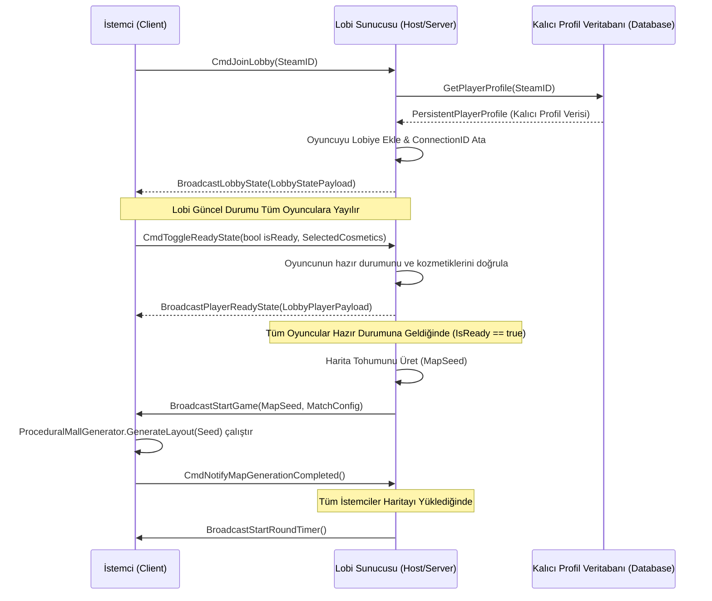

# Raund Döngüsü ve Kapanış/Kaçış Sistemi Tasarım Belgesi (Ultimate RoundCycleSystem)

Bu belge; lobi bağlantı ve hazır durumu el sıkışma (handshake) ağ protokollerini ve lobi bağlantı ağ veri paket (payload) yapılarını tanımlayan nihai teknik şartnameyi içerir.

---

## 1. Lobi Bağlantı ve Hazır Durumu Ağ Protokolü (Lobby Handshake Flow)

Maç öncesinde oyuncuların lobide toplanması, hazır durumlarının sunucu tarafından doğrulanması ve senkronize bir şekilde maça başlanması için kullanılan ağ akış süreci:



---

## 2. Lobi Bağlantı Ağ Paket Yapıları (Lobby Payloads)

Lobideki oyuncu durumlarını ve maç ayarlarını senkronize etmek için kullanılan ağ veri paketlerinin C# yapı tasarımları:

### 2.1 LobbyPlayerPayload (Oyuncu Durum Paketi)
Bir oyuncunun lobideki hazır durumunu, ismini ve seçtiği kozmetikleri senkronize eden paket yapısı:

```csharp
[Serializable]
public struct LobbyPlayerPayload
{
    public ulong SteamId; // Oyuncunun eşsiz Steam kimliği
    public string DisplayName; // Oyuncunun lobi adı
    public bool IsReady; // Hazır olup olmadığı
    public string EquippedCharacterSkinId; // Seçtiği karakter model ID'si
    public string EquippedCartSkinId; // Seçtiği araba rengi/deseni ID'si
    public string EquippedHornId; // Seçtiği korna sesi ID'si
    public float PingMs; // Bağlantı gecikme süresi
}
```

### 2.2 LobbyStatePayload (Lobi Maç Ayarları Paketi)
Maç başlatılmadan önce lobi lideri tarafından değiştirilebilen ve tüm istemcilere yansıtılan maç kuralları paketi:

```csharp
[Serializable]
public struct LobbyStatePayload
{
    public string LobbyRoomCode; // Lobiye katılmak için gereken oda kodu (#2481)
    public int ActivePlayerCount; // Lobideki güncel oyuncu sayısı
    public List<LobbyPlayerPayload> ConnectedPlayers; // Bağlı tüm oyuncuların detaylı listesi
    public QuotaDifficulty MatchDifficulty; // Kolay, Orta, Zor zorluk ayarı
    public float CustomizableRoundDuration; // Ayarlanan raund süresi (saniye)
    public int MaxDaysLimit; // Gün sınırı (Sınırsız veya 5, 7, 10 gün)
    public GameMode SelectedMode; // FFA veya 2v2 Takım Modu
}
```

---

## 3. İstemci-Sunucu Zaman Senkronizasyonu (Clock Drift Sync)

Raund süresi ve gece fazı geçişlerinin tüm istemcilerde saniyesi saniyesine aynı anda tetiklenmesi amacıyla ağ senkronizasyon hesabı:

### 3.1 Network Zaman Sapması Formülü
\[T_{offset} = \frac{(T_{rx\_server} - T_{tx\_client}) + (T_{tx\_server} - T_{rx\_client})}{2}\]
\[\text{Rtt} = (T_{rx\_client} - T_{tx\_client}) - (T_{tx\_server} - T_{rx\_server})\]

Burada:
- \(T_{tx\_client}\): İstemcinin senkronizasyon isteğini gönderdiği anlık zaman.
- \(T_{rx\_server}\): Sunucunun isteği aldığı zaman.
- \(T_{tx\_server}\): Sunucunun cevabı gönderdiği zaman.
- \(T_{rx\_client}\): İstemcinin cevabı aldığı zaman.
- \(\text{Rtt}\): Toplam git-gel ağ gecikmesi (Round Trip Time).

### 3.2 Senkronizasyon Akış Kodu
```csharp
public class NetworkTimeManager : Entity
{
    private float serverTimeOffset = 0f;
    private float lastSyncTime = 0f;

    public float NetworkTime => RealTime.Now + serverTimeOffset;

    [ClientRpc]
    public void ReceiveTimeSyncResponse(float clientTxTime, float serverRxTime, float serverTxTime)
    {
        float clientRxTime = RealTime.Now;
        float rtt = (clientRxTime - clientTxTime) - (serverTxTime - serverRxTime);
        serverTimeOffset = ((serverRxTime - clientTxTime) + (serverTxTime - clientRxTime)) / 2f;
        
        Log.Info($"Zaman Senkronize Edildi. RTT: {rtt * 1000f:F1}ms, Sapma Ofseti: {serverTimeOffset * 1000f:F1}ms");
    }
}
```

---

## 4. Dikey Kat Kilit Açma Asansörü Arayüzü (Elevator ASCII Mockup)

```text
=====================================================
|                AVM MAĞAZA ASANSÖRÜ                |
=====================================================
|  [ MEVCUT ORTAK KOTA DURUMU ]                     |
|   Kotaya Yatırılan: $4,500 / $6,000               |
|   Asansör Güç Durumu: Yetersiz Güç                |
=====================================================
|  KAT SEÇİM PANELİ:                                |
|                                                   |
|  [ ] Kat 3: Elektronik & Lüks Tüketim   [KİLİTLİ] |
|      (Gereken Kota: $6,000)                       |
|                                                   |
|  [X] Kat 2: Ev Dekorasyon & Yapı Market [AKTİF]   |
|      (Kilit Açıldı!)                              |
|                                                   |
|  [X] Kat 1: Süpermarket & Giyim         [AKTİF]   |
|      (Giriş Katı)                                 |
=====================================================
```
*(Katlar arasındaki geçiş asansörün içindeki bu panel yardımıyla takip edilir. Ortak kota barajı aşıldığında üst katın düğmesi yeşil renge dönerek aktifleşir).*

---

## 5. Dinamik Güvenlik ve Alarm Dereceleri (Security Levels)

Oyun içi gerilim ve robot yapay zeka parametrelerini ölçeklendiren dynamic alarm dereceleri:

- **Seviye 1 (Sakin / Sabah):** Robotlar temel hızda devriye atar. Uyarı sireni kapalıdır.
- **Seviye 2 (Şüpheli):** Bir robot bir oyuncuyu gördüğünde veya alarm butonuna basıldığında tetiklenir. Tüm robotların hareket hızları \(x1.15\) artar. Görüş açıları (FOV) \(90^\circ\)'den \(100^\circ\)'ye çıkar.
- **Seviye 3 (Kritik Alarm):** Sesli alarm çalmaya başlar. Güvenlik kameraları aktif taramaya geçer. Robot hızları \(x1.3\) artar. Görüş mesafeleri %20 uzar. Sesten arınma (sakinleşme) süreleri 30 saniyeye uzar.
- **Seviye 4 (Kilitlenme / Lockdown):** Oyuncuların reyon hasarı/hırsızlığı tavan yaptığında veya kotalar ödenemediğinde tetiklenir. Kat kapıları ve reyon geçişleri kepenklerle geçici olarak mühürlenir.
- **Seviye 5 (Maksimum Tehdit / Gece Fazı):** Raundun son %20'lik diliminde tetiklenir. AVM genel ışıkları söner. Ana mağaza kepenkleri tamamen iner. Fenerli Gece Bekçileri spawn olur. Robot hızları \(x1.5\) olur ve yakalanma anında doğrudan nezarethaneye ışınlama gerçekleşir.

---

## 6. Nezarethane ve Jailbreak Mekanikleri (Jail & Rescue System)

Yakalanan oyuncuların nezarethaneye kapatılması ve kurtulma yöntemleri:

- **Giriş ve Eşya Koruması:** Yakalanan oyuncu kelepçelenerek en yakın Nezarethane (Jail) hücresine ışınlanır. Hücrede tutulan oyuncunun araba envanterine diğer oyuncular dışarıdan erişemez, yani mallar çalınamaz.
- **Lockpick Kurtarma (Dışarıdan Yardım):** Takım arkadaşları hücre kapısındaki elektrik paneline yaklaşarak `[E]` tuşuna basılı tutar. 5 saniyelik bir kablo sabote etme QTE'si gerçekleştirilerek kapı açılır.
- **Havalandırma Kaçışı (İçeriden Çıkış):** Hücredeki oyuncu havalandırma kapağına yaklaşarak `[E]` basılı tutar. 15 saniye süren bu eylem yüksek düzeyde fiziksel metal gürültüsü üretir ve \(8\text{ metre}\) yarıçapındaki tüm güvenlik robotlarını o yöne çeker.

---

## 7. Kaçış Kapıları ve Tahliye Sistemleri (Escape Gates & Evacuation)

Kapanış saati başladığında hayatta kalanların AVM'den kaçış prosedürleri:

### 7.1 Kepenk Açma ve Güç Kutusu Sabotajı (Bypass QTE)
Gece fazı başladığında çıkış kapıları (Otopark Çıkışı ve Tahliye Asansörü) kilitli ve kepenkleri iniktir.
- **Sabotaj:** Çıkış kapısının yanındaki Güç Kutusunun (Power Box) kapısı `[E]` ile açılır.
- **Kablo Bağlama:** 8 saniyelik ritmik QTE tamamlandığında jeneratör devreye girer ve kepenkler saniyede \(0.5\text{ metre}\) hızla yukarı doğru açılmaya başlar.

### 7.2 Tahliye Edilmeme Cezası
Süre bittiğinde kaçış kapıları tamamen kilitlenir. AVM içinde kalan tüm oyuncular "Kayıp" sayılır.
- **Ceza:** O raund boyunca toplanan tüm USD değeri sıfırlanır, arabaya takılı olan tüm modifikasyonlar kaybolur ve run kalıcı olarak başarısız sayılır (AVM Sadakat Puanı kazanılmaz).


